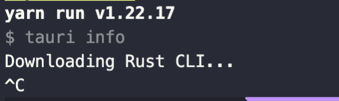
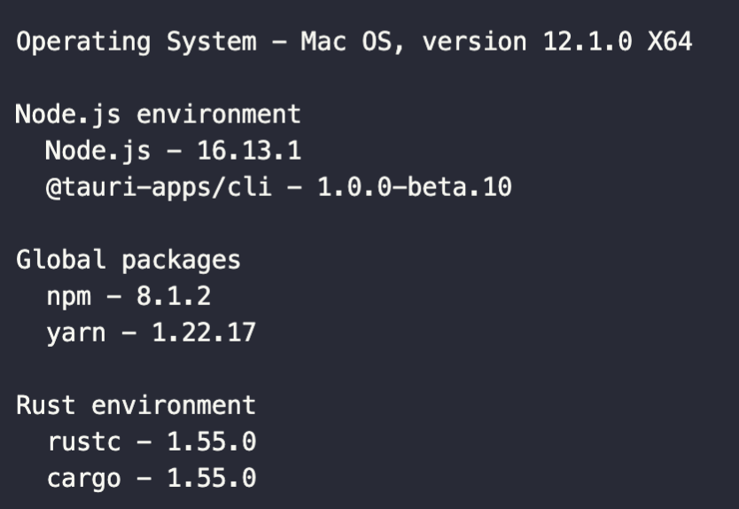
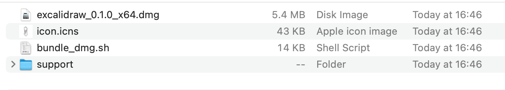
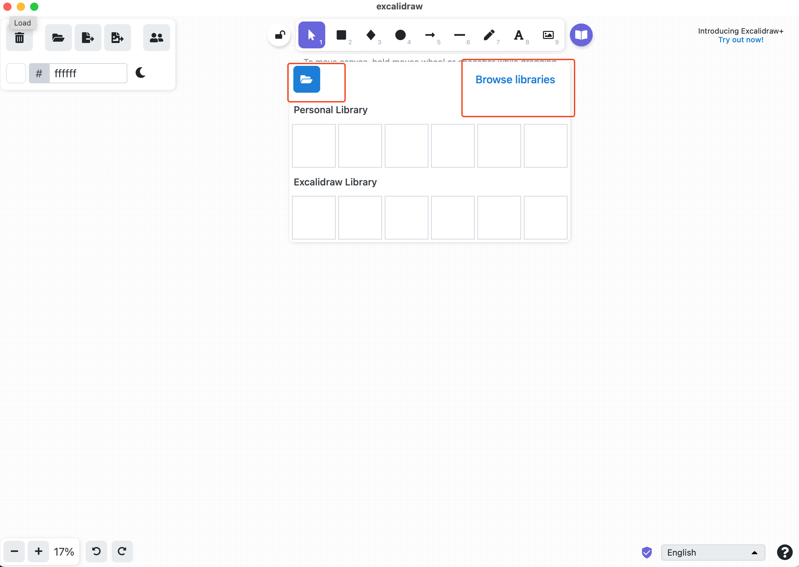
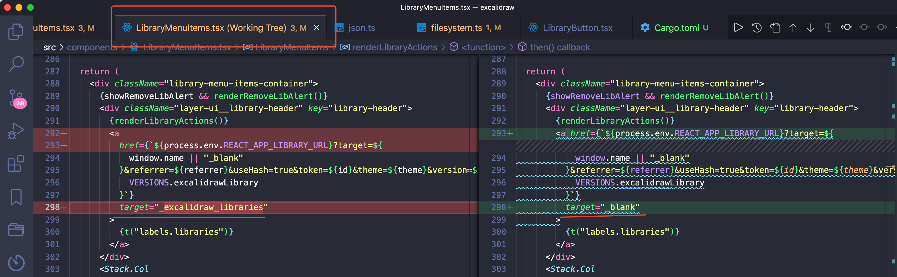

# 300 Seconds: Create a desktop  application

OS: macOS Monterey Version12.1

## Let’s go

1. Make sure that you have installed node.js and rust (rustc & Cargo) successfully.
  
2. `git clone https://github.com/excalidraw/excalidraw.git`
3. Add Tauri to Existing Project (excalidraw)

``` shell
cd excalidraw
yarn add -D @tauri-apps/cli
```

4. Define a custom script to package.json:

``` json
{
  // This content is just a sample
  "scripts": {
    "tauri": "tauri"
  }
}
```

5. 👀 Check tauri info to Make Sure Everything Is Set up Properly: `yarn tauri info`
😭 But stucking in  `Downloading Rust CLI…`

🎉 Try to install tauri global, it worked.

1. Build Excalidraw Web App: `yarn build`
2. `tauri init`
3. Replace `src-tauri/icons/icon.icns` to Excalidraw logo( Use [AnyConv](https://anyconv.com/png-to-icns-converter/) convert png files to icns online)
4. `tauri build`
5. Install App which one is in `excalidraw/src-tauri/target/release/bundle/dmg`

6. Enjoy Excalidraw. Everything is prefect but “import libraries” and “Browse libraries”.


- Q: Browse libraries; A: 👇
  
- Q: import libraries.
 A: ❗️**TODO**(maybe sth wrong about [browser-fs-access](https://www.npmjs.com/package/browser-fs-access))

## Some Tips

### How to debug tauri apps

**Dev:**

1. `tauri dev`, it will automatically launch the application
2. `F12`(Windows) or `cmd+alt+i`(Mac) to open DevTools; Right mouse click and then inspect elements

**Build:**

1. `tauri build --debug`
2. `F12`(Windows) or `cmd+alt+i`(Mac) to open DevTools; Right mouse click and then inspect elements

If your application listen for all keyboard events and right mouse click events,
you may can't open DevTools.

## References

- [What is Tauri? | Tauri Studio](https://tauri.studio/docs/about/intro/)
- [excalidraw: Virtual whiteboard for sketching hand-drawn like diagrams](https://github.com/excalidraw/excalidraw)
- [Rust](https://www.rust-lang.org/)
- [Node.js](https://nodejs.org/en/)
- [electronjs-quick-start](https://www.electronjs.org/docs/latest/tutorial/quick-start)
