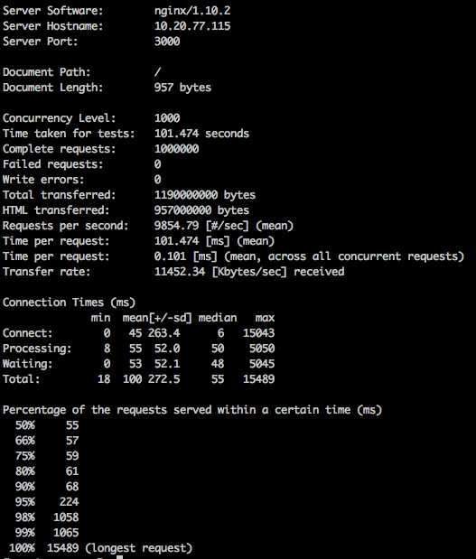
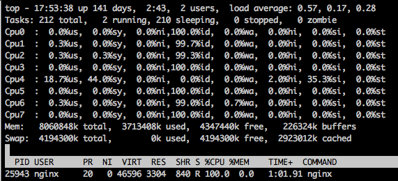
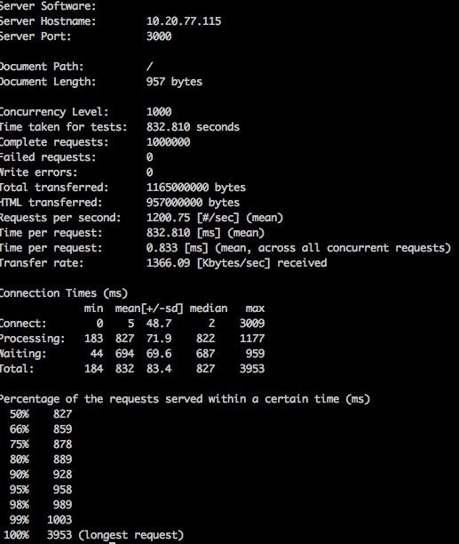
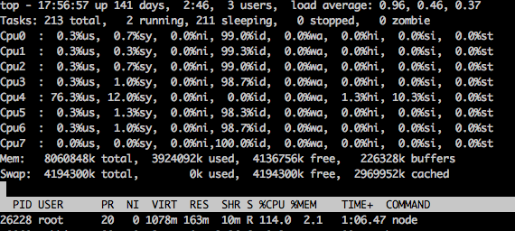

# Serve Static Content 

A comparession about serve static content which use NodeJS or Nginx.
Try to fetch one css file, two js file and one imgae, you can check the `public/index.html` for detail information.

**CONCLUSION**: Please use nginx to serve static content.

**Good To Read:**

* [5 Performance Tips for Node.js Applications](https://www.nginx.com/blog/5-performance-tips-for-node-js-applications/)
* [Nginx - SERVING STATIC CONTENT](https://www.nginx.com/resources/admin-guide/serving-static-content/)

## Getting started

### Machines

|     Usage      |     OS     | Memory | CPU  |
| :------------: | :--------: | :----: | :--: |
|     Server     | CentOS-6.6 |   8G   |  x8  |
| Client for ben | CentOS-7.0 |   8G   |  x8  |

### Install and Config

1. `git clone https://github.com/nepaul/web-demos.git` or download zip
2. `cd compare-serve-static-content`
3. Install Packages: `npm install`
4. Install nginx: [Official Guide](https://www.nginx.com/resources/wiki/start/topics/tutorials/install/)
5. Config Nginx: Copy `./nginx/nginx.conf` to your nginx config directory, and modify `root` parameter

### Benchmarking

1. Strat NodeJS Server: `npm start` or Start Nginx Server: `nginx
2. Use [ab](http://httpd.apache.org/docs/2.4/programs/ab.html) to benchmarking: `ab -c1000 -r1000000 http://your-server-ip:3000/`

### Report
Obvious, nginx performance is more better then node to serve static contents.

#### nginx server

#### Node server

## Author

[Poe Nee](http://nepaul.github.io/)([@xsnepaul](https://twitter.com/xsnepaul) on Twitter)

## License

[MIT](https://github.com/nepaul/web-demos/blob/master/LICENSE)
